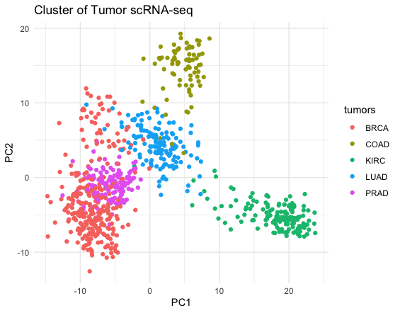
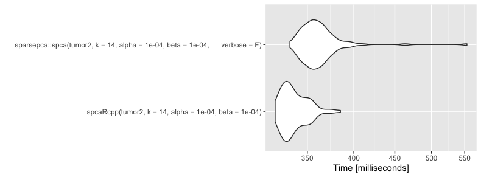

Submit your final project report and the code.

Your canvas submission must include a written report (25 points) with <5,000 words. The report is expected to provide a brief introduction of the project, description of the problem to be solved, description of the algorithms, evaluation of the results at the minimum. You may include display items such as figures and tables, and the total length should be no longer than 5 pages (and the expected length is 3 pages).

Submit your report as a PDF file. 

A recommended way to submit your code (50 points) is to host your package in a public GitHub repository. Users should be able to install your package using devtools::install_github("username/repositoryname"), your report simply needs to include the URL for the repository in the first page of your report. As previously announced, the code will be grade based on novelty (30%), difficulty (30%), and the degree of completion (40%).

If you cannot host a GitHub repository, you need to include the source code of the R package (.tar.gz) in this submission. In such as case, make a zip file containing both the PDF file and the package in your submission.

### Links:
https://github.com/srhaup2/clustering_scRNA  
https://github.com/BoyaJiang/spcaRcpp  
Google Colab:  
https://colab.research.google.com/drive/14U0oFzB21j1-rswnQfkHt3YT93l2Z9-7#scrollTo=v3tym2Lcq5v- 
Datase:  
https://archive.ics.uci.edu/ml/datasets/gene+expression+cancer+RNA-Seq  

## Introduction
* problem and challenge
* dataset

## Algorithms
### 1. spcaRcpp
|    Principal component analysis (PCA) is a popular data-processing and dimension-reduction technique. However, PCA suffers from the fact that each principal component is a linear combination of all the variables, making it difficult to interpret the results. Sparse principal component analysis (SPCA) is a special variant of PCA that promotes sparsity in the modes. The resulting sparse modes have only a few active (non-zero) coefficients, while the marjority of coefficients are zero. As a consequence, the model has improved interpretability, because the principal components are formed as a linear combination of only a few of the original variables. This method also prevents overfitting in a data setting where the number of variables is much greater than the number of observations ($n >> p$).  

|    The formulation of SPCA by Zou, Hastie and Tibshirani [1] directly incorporates sparsity inducing regularizers into the optimization problem:  

$$
\begin{array}{l}
\underset{\mathbf{A}, \mathbf{B}}{\operatorname{minimize}} f(\mathbf{A}, \mathbf{B})=\frac{1}{2}\left\|\mathbf{X}-\mathbf{X B A}^{\top}\right\|_{\mathrm{F}}^{2}+\psi(\mathbf{B}) \\
\text { subject to } \mathbf{A}^{\top} \mathbf{A}=\mathbf{I}
\end{array}
$$
where **$B$** is a sparse weight matrix and **$A$** is an orthonormal matrix. The penalty **$\psi$** denotes a sparsity inducing regularizer such as the elastic net. Specifically, the optimization problem is minimized using an alternating algorithm:   

- **Update A**. With **$B$** fixed, we find an orthonormal matrix $\mathbf{A}^{\top} \mathbf{A}=\mathbf{I}$ which minimizes
$$
\left\|\mathbf{X}-\mathbf{X B A}^{\top}\right\|_{F}^{2} .
$$
which has the closed form solution $\mathbf{A}^{*}=\mathbf{U V}^{\top}$, where $\mathbf{X}^{\top} \mathbf{X B}=\mathbf{U \Sigma} \mathbf{V}^{\top}$.
- **Update B**. With **$A$** fixed, we solve the optimization problem     
$$
\min _{\mathbf{B}} \frac{1}{2}\left\|\mathbf{X}-\mathbf{X B A}^{\top}\right\|_{\mathrm{F}}^{2}+\psi(\mathbf{B}) .
$$   
The problem splits across the $k$ columns of $\mathbf{B}$, yielding a regularized regression problem in each case:   
$$
\mathbf{b}_{j}^{*}=\underset{\mathbf{b}_{j}}{\arg \min } \frac{1}{2}\left\|\mathbf{X} \mathbf{A}(:, j)-\mathbf{X} \mathbf{b}_{j}\right\|^{2}+\psi\left(\mathbf{b}_{j}\right)
$$   

|    The principal components can then be calculated as a sparsely weighted linear combination of the observed variables **$Z = XB$**. The **$B$** update step relies on an iterative method using proximal gradient methods to find a stationary point.  

|    There are several existing R packages that implements SPCA, i.e. ``sparsepca``, ``elasticnet``, and ``EESPCA``. Among these, the ``sparsepca::spca`` provided a starting point for optimizing the SPCA function. 

### 2. EM Algorithm

### 3. k means

## Results

## Discussion

## References
1. N.B.Erichson,P.Zheng,K.Manohar,S.Brunton,J.N.Kutz,A.Y.Aravkin."SparsePrincipal Component Analysis via Variable Projection." Submitted to IEEE Journal of Selected Topics on Signal Processing (2018). (available at ‘arXiv https://arxiv.org/abs/1804.00341).  
2. N. B. Erichson, P. Zheng, S. Aravkin, sparsepca, (2018), GitHub repository  
3. McLachlan, G. J. and Peel, D. (2000) Finite Mixture Models, John Wiley \& Sons, Inc.  
4. Benaglia T, Chauveau D, Hunter DR, Young D (2009). “mixtools: An R Package for Analyzing Finite Mixture Models.” Journal of Statistical Software, 32(6), 1–29. http://www.jstatsoft.org/v32/i06/.  
5. https://www.eecs.umich.edu/techreports/systems/cspl/cspl-401.pdf

